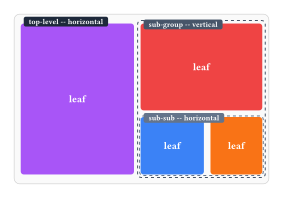

# mosaic

Aspect-ratio-preserving grid layouts for (mostly photo) mosaics.


Lays out grids of images (or arbitrary content) that fill an available box while
preserving every element's aspect ratio and keeping uniform gaps, and lets you either
build the layout tree yourself or have one searched for automatically.

## Usage


#### Auto-Layout To Fill Availble Space While Preserving Aspect Ratios

```typ
context display-auto-layout(
  (
    image("a.jpg"),
    image("b.jpg"),
    image("c.jpg"),
    (body: image("d.jpg"), weight: 2),                    // specify a weight (default: 1) to give this element more space in the auto-layout
    // (body: [Some Text], aspect: 0, constant-size: 3cm) // work-around for text or other content which can't be scaled the same way as images
  ),
  gap: 0.6em,
  selector: "1",                // best-scoring layout
  // selector: "1.", "1..", ... // equally well-scored reorderings of the same layout
  // selector: "2", "3", ...    // next-best layouts, in descending order of score
)
```


#### Layouts can be specified manually

A layout consits of alternating nested horzontally and vertically stacked containers, specified by nested arrays. To specify additional parameters, see [Manual layout: `display-content-tree`](#manual-layout-display-content-tree) below.

```typ
display-content-tree(
  (
    image("a.jpg"),
    (
      image("b.jpg"),
      (
        image("c.jpg"),
        image("d.jpg"),
      ),
    ),
  ),
  axis: "horizontal",
  gap: 0.6em,
)
```



These figures are themselves rendered with `display-auto-layout` (figures 1 and 3) and
`display-content-tree` (figure 2) — see `docs/figure1.typ`, `docs/figure2.typ`,
`docs/figure3.typ`, regenerate them with:

```bash
cd packages/mosaic && typst compile --root . docs/figure1.typ docs/figure1.svg --format svg
cd packages/mosaic && typst compile --root . docs/figure2.typ docs/figure2.svg --format svg
cd packages/mosaic && typst compile --root . docs/figure3.typ docs/figure3.svg --format svg
```

## Details

### Manual layout: `display-content-tree`

Give it a nested array describing the tree; the axis (`"horizontal"`/`"vertical"`)
alternates automatically at every nesting level starting from the `axis` you pass in.
Each item in the array is one of:

- `content` — a leaf with its aspect ratio auto-measured (e.g. `image("a.jpg")`)
- `(body: ..., aspect: float)` — a leaf with an explicit aspect ratio
- `(body: ..., aspect: 0, constant-size: length)` — a fixed-size leaf; `constant-size`
  becomes the width in a horizontal row or the height in a vertical stack
- `(body: ..., stretchable_: true)` — a leaf that absorbs any leftover space along its
  parent's axis (combinable with `constant-size` for a minimum size)
- a nested `array` — a sub-group, whose axis is the opposite of its parent's

For finer control than the array shorthand gives you — different gaps per level, or
assembling a tree piecemeal — build content-dicts directly with `make-content-dict` /
`add-body-to-content-dict`, then call `resolve-aspect`, `resolve-stretchable`, and
`fit-content-dict` yourself. See `test/layout.typ` for worked examples of every case
above, including constant-size and stretchable elements in nested layouts.

### Automatic layout: `display-auto-layout`

Give it a *flat* list of items (same per-item dict format as above, plus an optional
`weight: float`, default `1`) and it enumerates every way to recursively split them into
an alternating horizontal/vertical tree, scores each one by how closely each item's
rendered area matches its weight (plus a reward for filling the available box), and
renders the best-scoring tree:

```typ
#context box(width: 100%, height: 5cm)[
  #display-auto-layout(
    (
      (body: image("a.jpg"), weight: 2),
      image("b.jpg"),
      image("c.jpg"),
    ),
    gap: 0.5em,
    selector: "1",
  )
]
```

`selector` picks which ranked tree to render — `"1"` is the best-scoring, `"2"` the
second-best, and so on; trailing dots (`"1."`, `"1.."`) step through equal-cost
reorderings of the same tree (e.g. mirroring which side the odd-one-out sits on).
`fill-weight` controls how strongly page-fill is rewarded relative to matching the given
weights, and `max-items` (default `8`) caps the item count, since the number of possible
trees grows very fast. See `test/auto-layout.typ` for examples of weights, ranking, and
stepping through symmetric variants.

## Limitations

The true behaviour of text content is not accounted for. Text requires a constant/miniumum _area_ constraint instead of the here implemented constant _aspect_ constraint. However, text can still be inserted with workarounds, which may need some manul tuning after the automatic layout creation.